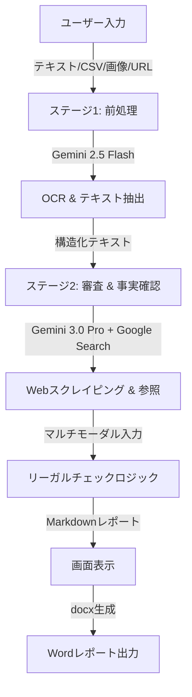

# AI広告リーガルチェックツール 機能要件書

## 1. 概要
本ツールは、広告テキストおよび広告クリエイティブ画像を、Googleの最新AIモデル（Gemini 3.0 Pro / Gemini 2.5 Flash）を用いて自動的に審査するシステムです。
法令（薬機法、景品表示法、貸金業法、医療法など）やプラットフォーム（LINE広告）のガイドラインに基づき、リスクのある表現を検知し、修正案を提示します。

---

## 2. システムアーキテクチャと処理フロー

本システムは以下の4段階のプロセスで構成されています。



---

## 3. スクレイピング（Web情報取得）の仕組み詳細

本ツールでは、従来のPythonライブラリ（BeautifulSoupやSeleniumなど）を用いたDOM解析型のスクレイピングではなく、**Gemini APIの「Google Search Grounding（検索グラウンディング）」機能**を採用しています。

### 3.1. 従来のスクレイピングとの違い
- **従来**: HTMLタグを解析し、特定のクラス名などを指定してテキストを抽出。サイト構造が変わると動かなくなるリスクがある。
- **本ツール**: AIが人間のようにGoogle検索エンジンを利用し、指定されたURLのページ内容を読み込み、文脈（コンテキスト）を理解する。

### 3.2. 実装詳細
`services/geminiService.ts` 内の `runStage2_FactFindAndReport` 関数において、以下の設定を行うことで実現しています。

```typescript
const response = await ai.models.generateContent({
    model: 'gemini-3-pro-preview', // 高度な推論が可能なモデル
    contents: contents,
    config: {
        // ここでGoogle検索ツールを有効化
        tools: [{googleSearch: {}}], 
    }
});
```

### 3.3. 実行プロセス
1. ユーザーが入力した「参照URL（LPなど）」をプロンプトに埋め込みます。
2. プロンプト内で「`referenceUrls` で指定されたURLの内容を検索ツールを使ってアクセス・分析せよ」とAIに指示します。
3. Geminiモデルは、Google検索インデックスを利用して当該URLの最新情報を取得（グラウンディング）します。
4. 取得した情報（価格、成分、キャンペーン条件など）を「事実情報（Fact Base）」としてメモリ上に展開し、広告文との突き合わせに使用します。

---

## 4. チェックロジックの仕組み詳細

本ツールは、単なるキーワードマッチング（NGワード検索）ではなく、**LLM（大規模言語モデル）による文脈理解とマルチモーダル推論**を行っています。

### 4.1. ナレッジベース注入（RAG的なアプローチ）
`constants.ts` ファイルに定義された膨大な法的ガイドライン（ナレッジベース）を、プロンプトの一部としてAIに渡しています。

- **KB1**: 必須確認項目（No.1表記の根拠など）
- **KB2**: LINE広告ガイドライン
- **KB3**: 一般的な誇大広告基準
- **KB4**: 金融・ローン業界ルール（貸金業法）
- **KB5**: 化粧品・薬機法ルール
- **KB6**: 医療・クリニック業界ルール（医療法）

### 4.2. 条件付き適用ロジック
プロンプトエンジニアリングにより、AIに対して「業界判定」を行わせ、適切なルールセットのみを適用させています。

> **プロンプト指示の例:**
> "広告内容が金融・ローン業界に該当すると判断した場合に限り、ナレッジベース④を適用してください。それ以外は無視してください。"

これにより、化粧品の広告に対して貸金業法のルール（年利表示など）が誤って適用されるのを防いでいます。

### 4.3. マルチモーダル・ビジュアルチェック
Gemini 3.0 Pro はマルチモーダル（テキストと画像を同時に理解可能）であるため、以下のような高度なチェックが可能です。

1. **画像のOCR**: 画像内の文字を読み取る（Gemini 2.5 Flashで実施）。
2. **視覚的チェック**: 画像そのものを解析し、以下の違反を検知する（Gemini 3.0 Proで実施）。
   - 「※注釈が背景色と同化して読めない」
   - 「打ち消し表示の文字サイズが極端に小さい」
   - 「画像内の『No.1』アイコンの近くに調査機関の記載がない」

---

## 5. 入力仕様

| 項目 | 説明 | 必須 |
| --- | --- | --- |
| **広告テキスト入力方法** | 直接入力 または CSVアップロード | どちらか任意 |
| **広告テキスト画像** | 広告文が含まれるスクリーンショット（最大8枚） | 任意 |
| **広告クリエイティブ画像** | バナー画像など（最大8枚） | 任意 |
| **参照URL** | リンク先LPや公式サイトのURL | 任意 |
| **クライアント共有情報** | Web非公開の補足情報（Notion参照） | 任意 |

※ 少なくとも1つの情報を入力すればチェックを開始できる仕様になっています。

---

## 6. 出力レポート仕様

### 6.1. 画面表示
Markdown形式で整形されたレポートを表示します。
- **NG項目**: 赤字で強調表示
- **判定**: OK✅ / NG❌ / 要確認⚠️ の統一フォーマット

### 6.2. Wordファイル (.docx)
法務確認フローに最適化されたWordファイルを生成します。
- 広告内容（テキスト・画像）の転記
- AI指摘事項の一覧
- **法務確認欄**: 人間が最終判断を下すための記入欄（コメント、修正指示、承認印欄）を自動付与

---

## 7. 使用技術スタック

- **Frontend**: React 19, TypeScript
- **Styling**: Tailwind CSS
- **AI SDK**: Google GenAI SDK (`@google/genai`)
- **Document Gen**: `docx` (Word生成), `file-saver`
- **Infrastructure**: ブラウザ上で完結（サーバーレス）
